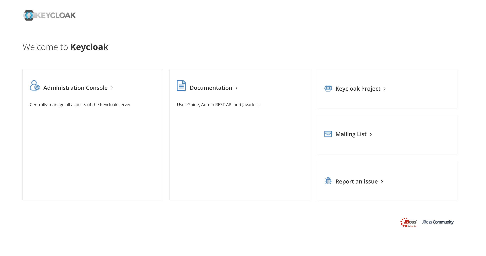
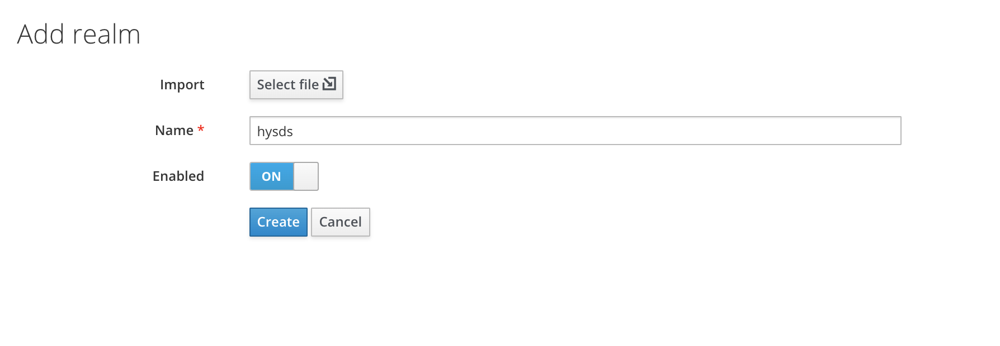
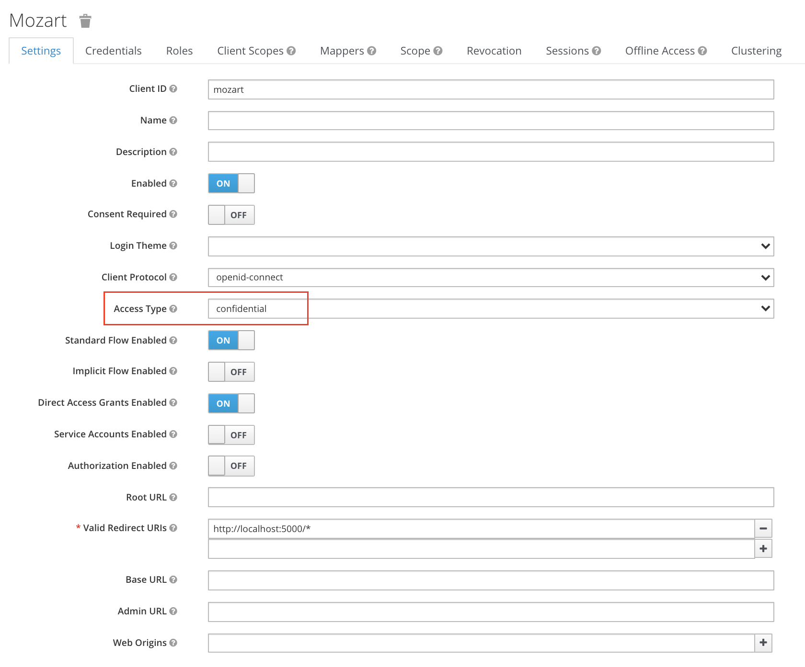
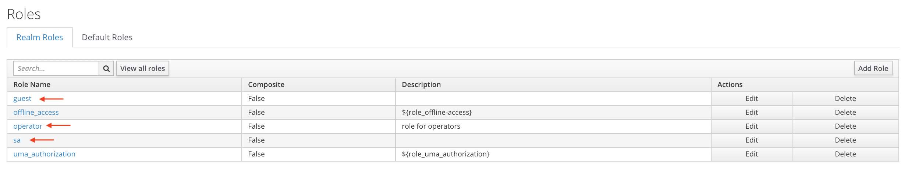
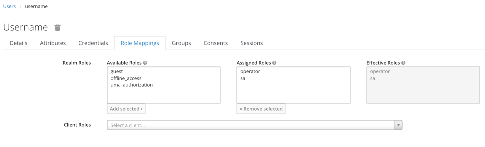
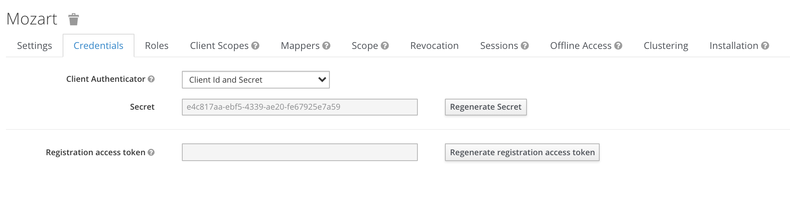

Testing out Keycloak authentication in a Flask Rest API
https://www.keycloak.org/

#### Activate virtual environment
```
# Preferably python3
$ virtualenv env

$ source env/bin/activate
$ pip install -r requirements.txt
```

#### Starting Keycloak server
```
$ ./standalone.sh
```

###### Access the admin console through `http://localhost:8080`


###### Adding the Realm in Keycloak


###### Create Client in Keycloak admin called Mozart
- Make sure `Access Type` is `confidential`


###### Create Realm roles through the admin


###### Create User in the realm then map the roles to the user


#### Filling in client_secrets.json with parameters from Keycloak
`client_secret` can be retrieved in the admin page for the `Mozart` client

```
{
  "web": {
    "issuer": "http://localhost:8080/auth/realms/hysds",
    "auth_uri": "http://localhost:8080/auth/realms/hysds/protocol/openid-connect/auth",
    "client_id": "mozart",
    "client_secret": "<client secret from keycloak client>",
    "redirect_uris": [
      "http://localhost:5000/*"
    ],
    "userinfo_uri": "http://localhost:8080/auth/realms/hysds/protocol/openid-connect/userinfo",
    "token_uri": "http://localhost:8080/auth/realms/hysds/protocol/openid-connect/token",
    "token_introspection_uri": "http://localhost:8080/auth/realms/hysds/protocol/openid-connect/token/introspect",
    "bearer_only": "true"
  }
}
```

#### Start Flask app
```
# separate tab
$ flask run
```

#### Getting auth token from Keycloak
```
$ export USERNAME=username
$ export PASSWORD=password
$ export CLIENT_SECRET=<client secret from Keycloak>

$ export AUTH_TOKEN=`curl -s \
  -d "client_id=mozart" -d "client_secret=$CLIENT_SECRET" \
  -d "username=$USERNAME" -d "password=$PASSWORD" \
  -d "grant_type=password" \
  "http://localhost:8080/auth/realms/hysds/protocol/openid-connect/token" | jq -r '.access_token'`

$ echo $AUTH_TOKEN
eyJhbGciOiJSUzI...cdsh5qONTHr7tsfOiKWSA5fscWaQ
```

#### Testing out Flask API endpoints
```
# returns 401 because /api endpoint is secured
$ curl -s http://localhost:5000/api | jq
{
  "error": "invalid_token",
  "error_description": "Token required but invalid"
}

$ curl -s -H "Authorization: Bearer $AUTH_TOKEN" http://localhost:5000/api | jq
{
  "hello": "World!!",
  "roles": [
    "operator",
    "sa"
  ]
}
```
